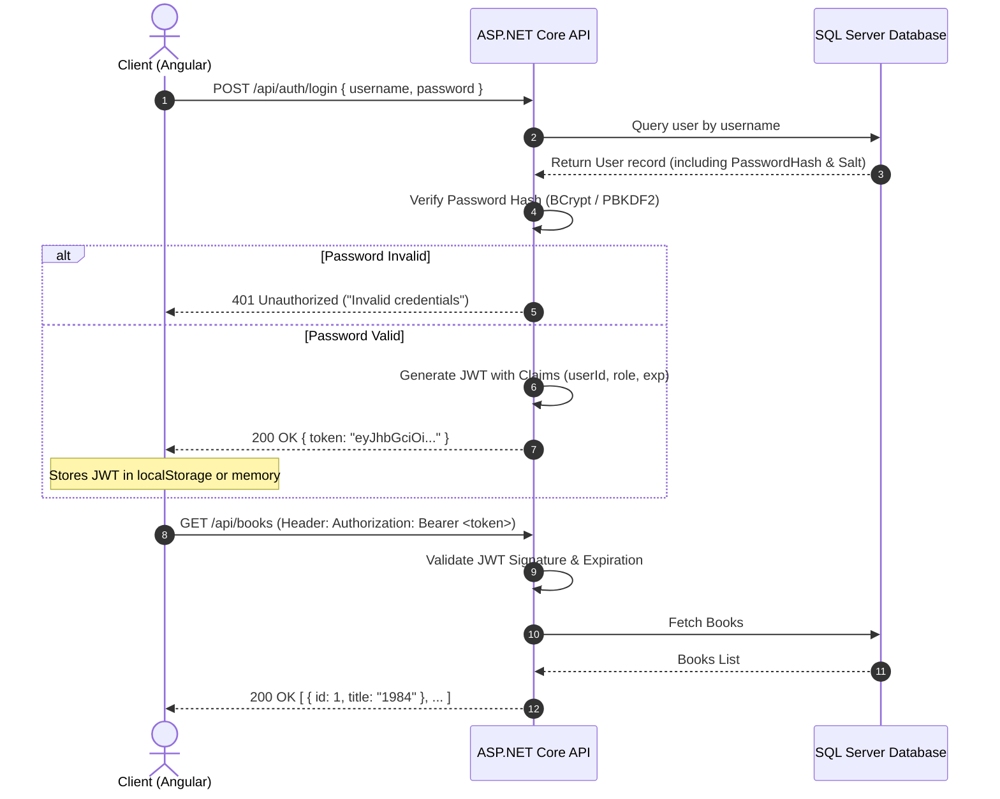

# Week 3 — Part D: Authentication & Authorization Concepts

## 1. Authentication vs. Authorization

| Concept | What it Means | Question it Answers | Example |
|---|---|---|---|
| **Authentication (AuthN)** | Verifying the identity of a user or process. | *"Who are you?"* | Entering your username and password, or scanning a biometric fingerprint. |
| **Authorization (AuthZ)** | Verifying whether the authenticated entity has permission to perform a specific action or access a resource. | *"What are you allowed to do?"* | A regular `Member` can view books, but only an `Admin` can delete a book from the library. |

> **Key Rule**: Authentication always comes first. You cannot determine what someone is authorized to do until you know who they are.

---

## 2. Password Hashing vs Plaintext Storage

### Why Plaintext Storage is Dangerous:
If passwords are stored as plain text in the database:
1. **Data Breaches**: If the database is leaked, compromised by SQL injection, or accessed by a rogue employee, all user credentials are instantly exposed.
2. **Credential Stuffing**: Users often reuse passwords across different platforms (e.g., email, banking). A single database leak compromises users across multiple internet services.
3. **Legal & Compliance Violations**: Storing plaintext passwords violates major industry standards (GDPR, PCI-DSS, SOC 2, HIPAA).

### How Password Hashing Works:
- **One-Way Hash Function**: Algorithms like **BCrypt**, **Argon2**, or **PBKDF2** transform passwords into fixed-length cryptographically secure hashes that cannot be reversed mathematically.
- **Salt**: A random cryptographic string added to the password prior to hashing. This ensures two identical passwords produce completely different hash outputs, defending against **Rainbow Table** attacks.
- **Verification**: When a user logs in:
  $$\text{Hash}(\text{Entered Password} + \text{Stored Salt}) == \text{Stored Hash}$$

---

## 3. JSON Web Token (JWT) Anatomy

A JWT is a compact, URL-safe token containing three distinct parts separated by dots (`.`):
$$\text{eyJhbGciOi...} \textbf{.} \text{eyJzdWIiOi...} \textbf{.} \text{SflKxwRJSMe...}$$

```
[ HEADER ] . [ PAYLOAD (Claims) ] . [ SIGNATURE ]
```

### 1. Header (Algorithm & Token Type)
Base64URL encoded JSON:
```json
{
  "alg": "HS256",
  "typ": "JWT"
}
```

### 2. Payload (Claims / Data)
Contains statements about the entity (user) and additional metadata:
```json
{
  "sub": "101",
  "name": "Asiya",
  "email": "asiya@example.com",
  "role": "Admin",
  "iat": 1725400000,
  "exp": 1725486400
}
```

### 3. Signature (Tamper-Proof Verification)
Calculated using the header, payload, and a secret key known only to the backend server:
```
HMACSHA256(
  base64UrlEncode(header) + "." +
  base64UrlEncode(payload),
  server_secret_key
)
```

> [!NOTE]
> The Header and Payload are **Base64-encoded, NOT encrypted**. Anyone can read the payload contents; however, **no one can modify any part of the payload without invalidating the Signature**.

---

## 4. Claims and Role-Based Authorization

- **Claims**: Key-value pairs embedded directly inside the JWT payload (e.g. `role: "Admin"`, `department: "Engineering"`).
- **Role-Based Authorization**: In ASP.NET Core, endpoints can be secured by evaluating token claims:
  ```csharp
  [Authorize(Roles = "Admin")]
  [HttpDelete("{id}")]
  public async Task<IActionResult> DeleteBook(int id) { ... }
  ```

---

## 5. End-to-End Authentication Sequence


